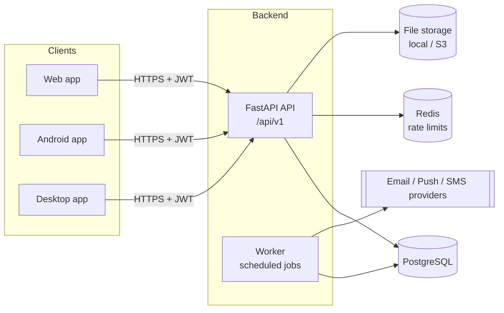

# 1–3. Technology stack, project structure and system architecture

## 1. Recommended backend technology stack

| Concern              | Choice                                   | Why                                                                                          |
|----------------------|------------------------------------------|----------------------------------------------------------------------------------------------|
| Language             | Python 3.12                              | Mature ecosystem, readable, strong typing with `typing` + Pydantic                           |
| Web framework        | **FastAPI**                              | Async, dependency injection, request validation and OpenAPI/Swagger generated from the code  |
| Validation / DTOs    | Pydantic v2                              | Fast (Rust core), strict types, JSON schema output feeds OpenAPI                             |
| ORM                  | SQLAlchemy 2.x (async) + asyncpg         | Explicit SQL control, typed `Mapped[]` models, avoids N+1 with `selectinload`/joins          |
| Migrations           | Alembic                                  | De-facto standard for SQLAlchemy, autogenerate + reviewed revisions                          |
| Database             | **PostgreSQL 17**                        | Transactions, `NUMERIC` money, partial indexes, `JSONB`, arrays, `INET`, robust concurrency   |
| Password hashing     | Argon2id (`argon2-cffi`)                 | OWASP-recommended memory-hard algorithm, transparent re-hash when parameters change          |
| Tokens               | JWT access tokens (PyJWT, HS256) + opaque rotating refresh tokens | Stateless request auth, server-side revocable sessions                 |
| Logging              | structlog (JSON in production)           | Structured, context-bound (request id, user id), secret redaction processor                  |
| Background jobs      | APScheduler in a dedicated worker process | Cron-like scheduling now; jobs are plain async functions, ready to move to a queue (arq/Celery) |
| Rate limiting        | Fixed-window limiter, memory or Redis backend | No external dependency in dev, shared counters across replicas in production            |
| File storage         | Pluggable `StorageBackend` (local disk now, S3-compatible later) | Files never coupled to the API container                                 |
| Tests                | pytest, pytest-asyncio, httpx `ASGITransport` | Fast in-process HTTP tests against a real PostgreSQL test database                     |
| Quality              | Ruff (lint + format), mypy                | One fast tool for style, imports and common bugs                                            |
| Packaging / runtime  | Docker multi-stage image, Docker Compose  | Same image for API and worker, one-command local environment                               |

FastAPI was preferred over NestJS/Express because the specification places a
heavy weight on validation and on *complete* OpenAPI documentation; with FastAPI
the Pydantic schemas are the single source of truth for both. PostgreSQL is
preferred over MySQL for partial unique indexes (e.g. "one mounted tire per
position"), `NUMERIC` correctness, array columns (document reminder offsets)
and `NULLS NOT DISTINCT`-style constraints.

## 2. Backend project folder structure

```
car-checker/
├── docker-compose.yml          # api + worker + postgres + redis
├── docs/                       # this documentation
└── backend/
    ├── Dockerfile              # multi-stage build, non-root runtime
    ├── docker/entrypoint.sh    # migrations + seed + exec
    ├── .env.example
    ├── pyproject.toml          # dependencies, ruff, mypy, pytest config
    ├── alembic.ini
    ├── migrations/             # Alembic environment + versioned revisions
    ├── app/
    │   ├── main.py             # create_app(): middleware, error handlers, routers
    │   ├── worker.py           # background scheduler process
    │   ├── cli.py              # seed, run-job, ... management commands
    │   ├── core/               # cross-cutting, framework-level code
    │   │   ├── config.py       # Settings (environment variables)
    │   │   ├── logging.py      # structlog configuration + redaction
    │   │   ├── exceptions.py   # AppError hierarchy (domain → HTTP mapping)
    │   │   ├── error_handlers.py
    │   │   ├── responses.py    # success/error envelopes
    │   │   ├── pagination.py   # page/limit params + metadata
    │   │   ├── security.py     # Argon2 hashing, JWT encode/decode
    │   │   ├── rate_limit.py
    │   │   ├── middleware.py   # request id, access log, security headers
    │   │   ├── ids.py          # time-ordered UUIDv7 generator
    │   │   ├── dates.py        # month arithmetic, "today" in a time zone
    │   │   ├── units.py        # km/mi, L/100km, km/L, MPG conversions
    │   │   └── i18n/           # translation catalogs (en, fr, ar)
    │   ├── db/
    │   │   ├── base.py         # declarative Base, naming convention, mixins
    │   │   ├── session.py      # async engine + session factory
    │   │   └── all_models.py   # imports every model (Alembic autogenerate)
    │   ├── api/
    │   │   ├── deps.py         # DB session, current user, vehicle access guards
    │   │   ├── router.py       # mounts module routers under /api/v1
    │   │   └── health.py
    │   ├── modules/            # one package per business capability
    │   │   ├── auth/           # register, login, tokens, password reset
    │   │   ├── users/          # profile, sessions, account deletion
    │   │   ├── audit/          # security audit trail
    │   │   ├── vehicles/       # vehicles + sharing (vehicle_access)
    │   │   ├── mileage/
    │   │   ├── garages/
    │   │   ├── maintenance/    # types, records, schedules, oil changes, calculator
    │   │   ├── parts/
    │   │   ├── tires/
    │   │   ├── documents/
    │   │   ├── alerts/         # alerts, reminders, alert engine
    │   │   ├── notifications/  # preferences, deliveries, channels
    │   │   ├── expenses/
    │   │   ├── fuel/
    │   │   ├── attachments/    # upload validation + storage backends
    │   │   ├── notes/
    │   │   ├── timeline/
    │   │   ├── dashboard/
    │   │   └── statistics/
    │   └── jobs/               # job registry, scheduler, advisory locks
    └── tests/
        ├── conftest.py         # test DB, transactional fixtures, HTTP client
        ├── unit/               # pure functions (calculators, validators)
        └── integration/        # HTTP-level tests per module
```

Each module follows the same internal layout:

| File          | Responsibility                                                         |
|---------------|------------------------------------------------------------------------|
| `models.py`   | SQLAlchemy ORM tables owned by the module                              |
| `schemas.py`  | Pydantic request/response DTOs (the public API contract)               |
| `service.py`  | Use cases: authorization-aware business logic, transactions            |
| `router.py`   | HTTP layer only: parse input, call the service, wrap the response      |
| `*.py`        | Pure domain logic (e.g. `calculator.py`) with no I/O, unit-tested      |

## 3. System architecture



### Layers and dependency rule

```
router (HTTP)  →  service (use cases)  →  models (persistence)
                         ↓
                 domain functions (pure)
```

* **Routers** know HTTP: status codes, query parameters, envelopes. They contain
  no business rules.
* **Services** own use cases and transactions. They receive the database session
  and the authenticated actor, enforce authorization (ownership / sharing role)
  and commit explicitly. A service method is the unit of work.
* **Domain functions** (maintenance due calculation, document status, fuel
  consumption, money/units helpers) are pure and deterministic: they take
  `today` and `current_mileage` as arguments, which makes them trivial to test.
* **Models** are plain SQLAlchemy mappings; they do not call services.

SQLAlchemy's `AsyncSession` already implements the unit-of-work and identity map
patterns, so a separate repository layer per entity would mostly duplicate it.
Query helpers live in services; when a module needs a reusable query it is a
module-level function, not a class hierarchy.

### Request lifecycle

1. `RequestContextMiddleware` assigns/propagates `X-Request-ID` and binds it to
   the logging context.
2. `SecurityHeadersMiddleware` adds hardened headers; CORS middleware applies the
   configured origins.
3. Rate limiting runs (global limit + stricter per-route limits on auth endpoints).
4. FastAPI validates the request against the Pydantic schema.
5. `get_current_user` decodes the JWT, checks the session is not revoked and that
   the user is active (one query).
6. Vehicle-scoped routes resolve the caller's role on the vehicle
   (`owner` / `editor` / `viewer`) with a single query; unknown or foreign
   vehicles return **404** so IDs cannot be probed.
7. The service executes the use case in one transaction and commits.
8. The router wraps the result in the success envelope; any `AppError` or
   validation error is converted to the error envelope by global handlers.

### Processes

| Process  | Command                    | Scaling                                                       |
|----------|----------------------------|---------------------------------------------------------------|
| `api`    | `uvicorn app.main:app`     | Stateless, horizontally scalable                              |
| `worker` | `python -m app.worker`     | One active scheduler; every job also takes a PostgreSQL advisory lock so a second replica cannot run the same job concurrently |

### Extensibility notes

* **OAuth providers**: authentication is isolated in `modules/auth`; adding a
  `user_identities(provider, subject, user_id)` table and a callback endpoint does
  not touch other modules.
* **Mechanic / fleet accounts**: global roles live on `users.role`, per-vehicle
  roles in `vehicle_access`. New roles extend the enums and the permission map.
* **OBD-II / automatic mileage**: `mileage_history.source` already distinguishes
  `manual`, `maintenance`, `fuel`, `obd`, `import`.
* **Manufacturer recommendations / VIN decoding / AI**: maintenance types carry
  default intervals; a future provider can propose schedules through the same
  service API.
* **Offline sync**: UUIDv7 primary keys (client-generatable, index friendly),
  `created_at`/`updated_at` on every entity; see the sync section in
  [02-database.md](02-database.md#offline-first-strategy).
* **Queues**: jobs are registered async callables; moving to arq or Celery means
  enqueuing the same callables instead of scheduling them in-process.
