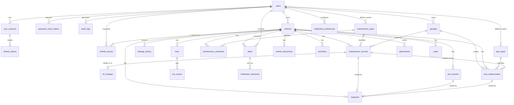

# 4–7, 22–23. Database design

PostgreSQL 17. All definitions below are implemented as SQLAlchemy models in
`backend/app/modules/*/models.py` and created by Alembic revisions in
`backend/migrations/versions/`.

## Conventions

| Rule                  | Decision                                                                                   |
|-----------------------|--------------------------------------------------------------------------------------------|
| Primary keys          | `id UUID` generated by the application as **UUIDv7** (time ordered → good B-tree locality, safe for offline clients) |
| Timestamps            | `created_at`, `updated_at` `TIMESTAMPTZ NOT NULL DEFAULT now()` on every table               |
| Business dates        | `DATE` (service date, expiration date…) — no time-zone ambiguity                            |
| Money                 | `NUMERIC(12,2)`; unit prices `NUMERIC(10,4)`; never floating point                          |
| Currency              | `vehicles.currency CHAR(3)` (ISO 4217). Every amount belonging to a vehicle is in that currency |
| Distances / volumes   | Stored canonically in **kilometres** and **litres**; conversion happens at the edges        |
| Enumerations          | `VARCHAR` + `CHECK` constraint (easy to extend in a migration, unlike native enum types)   |
| Constraint names      | Deterministic naming convention (`pk_`, `fk_`, `uq_`, `ix_`, `ck_`) for clean migrations    |
| Foreign keys          | Indexed. `ON DELETE CASCADE` for ownership (user → vehicles → records), `SET NULL` for optional references (garage, author), `RESTRICT` for catalog references (maintenance/part types) |
| Deletion              | Hard delete with cascades (see "Soft delete strategy")                                      |

## 4. ER model



`attachments` and `notes` reference their parent entity polymorphically
(`entity_type`, `entity_id`) and are always scoped to a vehicle.

## 5. Table definitions

Legend: **PK** primary key, **FK** foreign key, **U** unique, **NN** not null,
**IX** index. Every table also has `created_at` and `updated_at` (NN).

### Identity & security

#### `users`
| Column                     | Type          | Constraints                                         |
|----------------------------|---------------|-----------------------------------------------------|
| id                         | UUID          | PK                                                  |
| email                      | VARCHAR(320)  | NN, U (stored lower-cased)                          |
| password_hash              | VARCHAR(255)  | NN (Argon2id encoded string)                        |
| first_name / last_name     | VARCHAR(100)  | NN                                                  |
| phone_number               | VARCHAR(32)   |                                                     |
| preferred_language         | VARCHAR(5)    | NN, default `en`, CHECK in (`en`,`fr`,`ar`)         |
| preferred_currency         | CHAR(3)       | NN, default `EUR`                                   |
| preferred_distance_unit    | VARCHAR(2)    | NN, default `km`, CHECK in (`km`,`mi`)              |
| preferred_consumption_unit | VARCHAR(10)   | NN, default `l_100km`, CHECK in (`l_100km`,`km_l`,`mpg_us`,`mpg_uk`) |
| timezone                   | VARCHAR(64)   | NN, default `UTC` (IANA name, used for "today")     |
| role                       | VARCHAR(20)   | NN, default `user`, CHECK in (`user`,`admin`)       |
| is_active                  | BOOLEAN       | NN, default true                                    |
| email_verified_at          | TIMESTAMPTZ   |                                                     |
| last_login_at              | TIMESTAMPTZ   |                                                     |
| password_changed_at        | TIMESTAMPTZ   |                                                     |

#### `user_sessions` — one row per signed-in device
| Column        | Type         | Constraints                         |
|---------------|--------------|-------------------------------------|
| id            | UUID         | PK (also the `sid` claim of access tokens) |
| user_id       | UUID         | NN, FK → users ON DELETE CASCADE, IX |
| user_agent    | VARCHAR(512) |                                     |
| ip_address    | INET         |                                     |
| last_used_at  | TIMESTAMPTZ  | NN                                  |
| expires_at    | TIMESTAMPTZ  | NN                                  |
| revoked_at    | TIMESTAMPTZ  | (null = active)                     |

#### `refresh_tokens` — rotating tokens of a session
| Column      | Type        | Constraints                                    |
|-------------|-------------|------------------------------------------------|
| id          | UUID        | PK                                             |
| session_id  | UUID        | NN, FK → user_sessions ON DELETE CASCADE, IX   |
| token_hash  | CHAR(64)    | NN, U (HMAC-SHA256 of the opaque token)        |
| expires_at  | TIMESTAMPTZ | NN, IX (cleanup job)                           |
| used_at     | TIMESTAMPTZ | set when rotated; re-use ⇒ session revoked     |

#### `password_reset_tokens`
| Column     | Type        | Constraints                              |
|------------|-------------|------------------------------------------|
| id         | UUID        | PK                                       |
| user_id    | UUID        | NN, FK → users ON DELETE CASCADE, IX     |
| token_hash | CHAR(64)    | NN, U                                    |
| expires_at | TIMESTAMPTZ | NN                                       |
| used_at    | TIMESTAMPTZ |                                          |

#### `audit_logs`
| Column      | Type         | Constraints                                   |
|-------------|--------------|-----------------------------------------------|
| id          | UUID         | PK                                            |
| user_id     | UUID         | FK → users ON DELETE SET NULL; IX (user_id, created_at) |
| action      | VARCHAR(64)  | NN, IX (e.g. `auth.login`, `vehicle.deleted`) |
| entity_type | VARCHAR(64)  |                                               |
| entity_id   | UUID         |                                               |
| ip_address  | INET         |                                               |
| user_agent  | VARCHAR(512) |                                               |
| details     | JSONB        | NN, default `{}` (never contains secrets)     |

### Vehicles

#### `vehicles`
| Column               | Type          | Constraints                                                 |
|----------------------|---------------|-------------------------------------------------------------|
| id                   | UUID          | PK                                                          |
| owner_id             | UUID          | NN, FK → users ON DELETE CASCADE, IX                        |
| nickname             | VARCHAR(100)  |                                                             |
| brand / model        | VARCHAR(64)   | NN                                                          |
| trim                 | VARCHAR(64)   |                                                             |
| year                 | SMALLINT      | NN, CHECK 1886–2100 (API: ≤ current year + 1)               |
| license_plate        | VARCHAR(20)   | IX                                                          |
| vin                  | VARCHAR(32)   | U per owner (partial: `WHERE vin IS NOT NULL`)              |
| fuel_type            | VARCHAR(20)   | NN, CHECK enum                                              |
| transmission_type    | VARCHAR(20)   | CHECK enum                                                  |
| engine               | VARCHAR(64)   |                                                             |
| engine_displacement_cc | INTEGER     | CHECK > 0                                                   |
| horsepower           | SMALLINT      | CHECK > 0                                                   |
| color                | VARCHAR(32)   |                                                             |
| purchase_date        | DATE          |                                                             |
| purchase_price       | NUMERIC(12,2) | CHECK ≥ 0                                                   |
| currency             | CHAR(3)       | NN (defaults to owner's preferred currency)                 |
| initial_mileage      | INTEGER       | NN, default 0, CHECK ≥ 0                                    |
| current_mileage      | INTEGER       | NN, default 0, CHECK ≥ 0                                    |
| status               | VARCHAR(20)   | NN, default `active`, CHECK in (`active`,`sold`,`archived`) |
| image_attachment_id  | UUID          | FK → attachments ON DELETE SET NULL                         |
| notes                | TEXT          |                                                             |

#### `vehicle_access` — sharing
| Column        | Type        | Constraints                                         |
|---------------|-------------|-----------------------------------------------------|
| id            | UUID        | PK                                                  |
| vehicle_id    | UUID        | NN, FK → vehicles ON DELETE CASCADE                 |
| user_id       | UUID        | NN, FK → users ON DELETE CASCADE, IX                |
| role          | VARCHAR(10) | NN, CHECK in (`editor`,`viewer`)                    |
| granted_by_id | UUID        | FK → users ON DELETE SET NULL                       |
| —             |             | U (vehicle_id, user_id)                             |

The owner is `vehicles.owner_id`; it is not duplicated in `vehicle_access`, so
there is exactly one source of truth for ownership.

#### `mileage_history`
| Column        | Type        | Constraints                                                        |
|---------------|-------------|--------------------------------------------------------------------|
| id            | UUID        | PK                                                                 |
| vehicle_id    | UUID        | NN, FK → vehicles ON DELETE CASCADE; IX (vehicle_id, recorded_on)  |
| mileage       | INTEGER     | NN, CHECK ≥ 0                                                      |
| recorded_on   | DATE        | NN                                                                 |
| source        | VARCHAR(20) | NN, CHECK in (`initial`,`manual`,`maintenance`,`fuel`,`part`,`tire`,`obd`,`import`) |
| notes         | TEXT        |                                                                    |
| created_by_id | UUID        | FK → users ON DELETE SET NULL                                      |

### Service providers

#### `garages`
`id` PK · `user_id` NN FK → users CASCADE, IX · `name` VARCHAR(120) NN ·
`garage_type` VARCHAR(20) NN CHECK (`garage`,`mechanic`,`dealership`,`tire_shop`,`body_shop`,`inspection_center`,`other`) ·
`contact_name`, `phone`, `email`, `address`, `city`, `country`, `website`, `notes`.

### Maintenance

#### `maintenance_types` (catalog: system + user-defined)
| Column                  | Type         | Constraints                                                  |
|-------------------------|--------------|--------------------------------------------------------------|
| id                      | UUID         | PK                                                           |
| user_id                 | UUID         | FK → users ON DELETE CASCADE, IX; **NULL = system type**     |
| code                    | VARCHAR(50)  | U where `user_id IS NULL` (stable key for i18n, e.g. `oil_change`) |
| name                    | VARCHAR(100) | NN; U (user_id, name) for custom types                       |
| category                | VARCHAR(20)  | NN, CHECK enum (`engine`,`filters`,`fluids`,`brakes`,…)      |
| description             | TEXT         |                                                              |
| default_interval_km     | INTEGER      | CHECK > 0                                                    |
| default_interval_months | SMALLINT     | CHECK > 0                                                    |

#### `maintenance_records`
| Column              | Type          | Constraints                                               |
|---------------------|---------------|-----------------------------------------------------------|
| id                  | UUID          | PK                                                        |
| vehicle_id          | UUID          | NN, FK → vehicles CASCADE; IX (vehicle_id, service_date)  |
| maintenance_type_id | UUID          | NN, FK → maintenance_types **RESTRICT**, IX               |
| garage_id           | UUID          | FK → garages SET NULL, IX                                 |
| kind                | VARCHAR(20)   | NN, default `maintenance`, CHECK in (`maintenance`,`repair`) |
| title               | VARCHAR(200)  | NN                                                        |
| description         | TEXT          |                                                           |
| service_date        | DATE          | NN                                                        |
| mileage             | INTEGER       | CHECK ≥ 0                                                 |
| cost                | NUMERIC(12,2) | CHECK ≥ 0 (defaults to labor + parts when omitted)        |
| labor_cost          | NUMERIC(12,2) | CHECK ≥ 0                                                 |
| parts_cost          | NUMERIC(12,2) | CHECK ≥ 0                                                 |
| notes               | TEXT          |                                                           |
| created_by_id       | UUID          | FK → users SET NULL                                       |

#### `oil_changes` (1:1 extension of a maintenance record)
`maintenance_record_id` PK + FK → maintenance_records CASCADE · `oil_brand` ·
`oil_type` CHECK (`synthetic`,`semi_synthetic`,`mineral`,`high_mileage`,`other`) ·
`oil_viscosity` (e.g. `5W-30`) · `oil_quantity_liters` NUMERIC(5,2) CHECK > 0 ·
`oil_filter_changed` BOOLEAN NN · `filter_brand` · `filter_reference`.

Service date, mileage, cost, garage and notes live on the parent maintenance
record, so oil changes appear in maintenance history, statistics, schedules and
the timeline without special cases.

#### `maintenance_schedules`
| Column                | Type     | Constraints                                                     |
|-----------------------|----------|-----------------------------------------------------------------|
| id                    | UUID     | PK                                                              |
| vehicle_id            | UUID     | NN, FK → vehicles CASCADE                                       |
| maintenance_type_id   | UUID     | NN, FK → maintenance_types RESTRICT; U (vehicle_id, maintenance_type_id) |
| interval_km           | INTEGER  | CHECK > 0                                                       |
| interval_months       | SMALLINT | CHECK > 0; CHECK at least one interval is set                   |
| last_service_date     | DATE     |                                                                 |
| last_service_mileage  | INTEGER  | CHECK ≥ 0                                                       |
| next_service_date     | DATE     | IX (job scans) — derived, persisted                             |
| next_service_mileage  | INTEGER  | derived, persisted                                              |
| warning_before_km     | INTEGER  | NN, default 1000, CHECK ≥ 0                                     |
| warning_before_days   | INTEGER  | NN, default 30, CHECK ≥ 0                                       |
| enabled               | BOOLEAN  | NN, default true                                                |
| notes                 | TEXT     |                                                                 |

### Parts & tires

#### `part_types` — same shape as `maintenance_types` with `default_lifetime_km`, `default_lifetime_months`.

#### `part_replacements`
| Column                    | Type          | Constraints                                            |
|---------------------------|---------------|--------------------------------------------------------|
| id                        | UUID          | PK                                                     |
| vehicle_id                | UUID          | NN, FK → vehicles CASCADE; IX (vehicle_id, installed_date) |
| part_type_id              | UUID          | NN, FK → part_types RESTRICT, IX                       |
| maintenance_record_id     | UUID          | FK → maintenance_records SET NULL                      |
| garage_id                 | UUID          | FK → garages SET NULL                                  |
| part_name                 | VARCHAR(150)  | NN                                                     |
| brand, reference_number, serial_number | VARCHAR(80) |                                            |
| position                  | VARCHAR(30)   | free text (`front`, `rear_left`, …)                    |
| quantity                  | SMALLINT      | NN, default 1, CHECK > 0                               |
| installed_date            | DATE          | NN                                                     |
| installed_mileage         | INTEGER       | CHECK ≥ 0                                              |
| price, labor_cost         | NUMERIC(12,2) | CHECK ≥ 0                                              |
| warranty_expiration_date  | DATE          |                                                        |
| expected_lifetime_km      | INTEGER       | CHECK > 0                                              |
| expected_lifetime_months  | SMALLINT      | CHECK > 0                                              |
| removed_date              | DATE          | set when superseded by a newer part of the same type/position |
| removed_mileage           | INTEGER       |                                                        |
| notes, created_by_id      |               |                                                        |

#### `tires`
`id` PK · `vehicle_id` NN FK CASCADE · `brand` NN · `model` · `size` NN (e.g. `205/55 R16 91V`) ·
`season` NN CHECK (`summer`,`winter`,`all_season`) · `dot_code` ·
`position` CHECK (`front_left`,`front_right`,`rear_left`,`rear_right`,`spare`) ·
`status` NN CHECK (`mounted`,`stored`,`discarded`) · `condition` CHECK (`new`,`good`,`fair`,`worn`,`damaged`) ·
`purchase_date`, `price`, `installed_date`, `installed_mileage`, `tread_depth_mm` NUMERIC(4,1),
`pressure_notes`, `notes`.
**Partial unique index** `(vehicle_id, position) WHERE status = 'mounted'` —
two mounted tires can never share a position.

#### `tire_events`
`id` PK · `tire_id` NN FK → tires CASCADE · `vehicle_id` NN FK → vehicles CASCADE (denormalized for timeline) ·
`event_type` NN CHECK (`installed`,`rotated`,`removed`,`inspected`,`repaired`,`discarded`) ·
`event_date` NN · `mileage` · `from_position` · `to_position` · `tread_depth_mm` · `notes`.
IX (vehicle_id, event_date).

### Documents, reminders, alerts, notifications

#### `vehicle_documents`
| Column          | Type         | Constraints                                                       |
|-----------------|--------------|-------------------------------------------------------------------|
| id              | UUID         | PK                                                                |
| vehicle_id      | UUID         | NN, FK → vehicles CASCADE; IX (vehicle_id, expiration_date)       |
| document_type   | VARCHAR(30)  | NN, CHECK (`insurance`,`registration`,`technical_inspection`,`road_tax`,`warranty`,`leasing`,`other`) |
| title           | VARCHAR(150) | NN                                                                |
| document_number | VARCHAR(80)  |                                                                   |
| issue_date      | DATE         |                                                                   |
| expiration_date | DATE         | IX; CHECK `expiration_date >= issue_date`                         |
| provider        | VARCHAR(120) |                                                                   |
| reminder_days   | INTEGER[]    | NN, default `{30,7,1,0}` (days before expiration)                 |
| notes, created_by_id |         |                                                                   |

Files are stored in `attachments` (`entity_type = 'vehicle_document'`).

#### `reminders` — user-defined reminders
`id` PK · `vehicle_id` NN FK CASCADE · `title` NN · `notes` · `due_date` · `due_mileage` ·
CHECK at least one of `due_date`/`due_mileage` · `warning_before_days` NN default 7 ·
`warning_before_km` NN default 500 · `completed_at` · `created_by_id`.

#### `alerts`
| Column          | Type         | Constraints                                                          |
|-----------------|--------------|----------------------------------------------------------------------|
| id              | UUID         | PK                                                                   |
| user_id         | UUID         | NN, FK → users CASCADE (recipient); IX (user_id, status, created_at) |
| vehicle_id      | UUID         | FK → vehicles CASCADE; IX (vehicle_id, status)                       |
| alert_type      | VARCHAR(30)  | NN, CHECK (`maintenance_due`,`document_expiration`,`insurance_expiration`,`inspection_due`,`part_lifetime`,`mileage_reminder`,`custom_reminder`,`system`) |
| source_type     | VARCHAR(30)  | IX (source_type, source_id)                                          |
| source_id       | UUID         |                                                                      |
| dedup_key       | VARCHAR(200) | NN; U (user_id, dedup_key) — makes generation idempotent             |
| title           | VARCHAR(200) | NN (rendered in the recipient's language)                            |
| message         | TEXT         | NN                                                                   |
| template_key    | VARCHAR(100) | i18n key, lets clients re-render in another language                 |
| template_params | JSONB        | NN, default `{}`                                                     |
| priority        | VARCHAR(10)  | NN, CHECK (`info`,`low`,`medium`,`high`,`critical`)                  |
| status          | VARCHAR(10)  | NN, default `active`, CHECK (`active`,`read`,`dismissed`,`resolved`) |
| trigger_date    | DATE         | deadline the alert refers to (due / expiration date)                 |
| trigger_mileage | INTEGER      | deadline mileage                                                     |
| read_at, dismissed_at, resolved_at | TIMESTAMPTZ |                                               |

#### `notification_preferences`
`id` PK · `user_id` NN FK CASCADE · `channel` NN CHECK (`in_app`,`email`,`push`,`sms`) ·
`alert_type` NN default `all` · `enabled` NN · `min_priority` NN default `low` ·
U (user_id, channel, alert_type).

#### `notification_deliveries` — outbox for external channels
`id` PK · `alert_id` NN FK → alerts CASCADE · `user_id` NN FK CASCADE · `channel` NN ·
`status` NN CHECK (`pending`,`sent`,`failed`,`skipped`) · `attempts` SMALLINT NN ·
`last_error` VARCHAR(500) · `sent_at` · U (alert_id, channel) · IX (status, created_at).

### Money & fuel

#### `fuel_records`
| Column          | Type          | Constraints                                             |
|-----------------|---------------|---------------------------------------------------------|
| id              | UUID          | PK                                                      |
| vehicle_id      | UUID          | NN, FK → vehicles CASCADE; IX (vehicle_id, mileage), IX (vehicle_id, fill_date) |
| fill_date       | DATE          | NN                                                      |
| mileage         | INTEGER       | NN, CHECK ≥ 0                                           |
| liters          | NUMERIC(8,3)  | NN, CHECK > 0                                           |
| price_per_liter | NUMERIC(10,4) | CHECK ≥ 0                                               |
| total_price     | NUMERIC(12,2) | CHECK ≥ 0 (derived from liters × price when omitted)    |
| full_tank       | BOOLEAN       | NN, default true                                        |
| missed_previous | BOOLEAN       | NN, default false (breaks the consumption chain)        |
| fuel_type       | VARCHAR(20)   | CHECK (`petrol`,`diesel`,`e85`,`lpg`,`cng`,`hydrogen`,`other`) |
| gas_station     | VARCHAR(120)  |                                                         |
| notes, created_by_id |          |                                                         |

#### `expenses` — the single ledger for money
| Column                | Type          | Constraints                                              |
|-----------------------|---------------|----------------------------------------------------------|
| id                    | UUID          | PK                                                       |
| vehicle_id            | UUID          | NN, FK → vehicles CASCADE; IX (vehicle_id, expense_date), IX (vehicle_id, category) |
| category              | VARCHAR(20)   | NN, CHECK (`maintenance`,`repairs`,`parts`,`fuel`,`insurance`,`taxes`,`parking`,`tolls`,`fines`,`washing`,`inspection`,`registration`,`other`) |
| title                 | VARCHAR(200)  | NN                                                       |
| amount                | NUMERIC(12,2) | NN, CHECK ≥ 0                                            |
| expense_date          | DATE          | NN                                                       |
| mileage               | INTEGER       | CHECK ≥ 0                                                |
| vendor                | VARCHAR(120)  |                                                          |
| maintenance_record_id | UUID          | U, FK → maintenance_records CASCADE                      |
| fuel_record_id        | UUID          | U, FK → fuel_records CASCADE                             |
| part_replacement_id   | UUID          | U, FK → part_replacements CASCADE                        |
| notes, created_by_id  |               | CHECK `num_nonnulls(maintenance_record_id, fuel_record_id, part_replacement_id) <= 1` |

Maintenance records (including oil changes), fuel fill-ups and standalone part
purchases with a cost create and maintain a **linked expense** in the same
transaction (parts installed during a maintenance are costed by it). Statistics
therefore read one table and nothing is counted twice. Linked expenses are
read-only through the expense endpoints (edit the source record instead).

### Files & notes

#### `attachments`
| Column          | Type         | Constraints                                                 |
|-----------------|--------------|-------------------------------------------------------------|
| id              | UUID         | PK                                                          |
| user_id         | UUID         | FK → users SET NULL (uploader)                              |
| vehicle_id      | UUID         | NN, FK → vehicles CASCADE, IX                               |
| entity_type     | VARCHAR(30)  | NN, CHECK (`vehicle`,`maintenance_record`,`part_replacement`,`expense`,`vehicle_document`,`fuel_record`,`tire`) |
| entity_id       | UUID         | NN; IX (entity_type, entity_id)                             |
| file_name       | VARCHAR(255) | NN (sanitized original name)                                |
| content_type    | VARCHAR(100) | NN (detected from magic bytes)                              |
| file_size       | BIGINT       | NN, CHECK > 0                                               |
| storage_backend | VARCHAR(20)  | NN (`local`, `s3`)                                          |
| storage_key     | VARCHAR(500) | NN, U (opaque, never derived from user input)               |
| checksum_sha256 | CHAR(64)     | NN                                                          |
| uploaded_at     | TIMESTAMPTZ  | NN                                                          |

#### `notes`
`id` PK · `vehicle_id` NN FK CASCADE · `user_id` FK SET NULL (author) ·
`entity_type`, `entity_id` (optional parent record of the vehicle, CHECK both or none) ·
`category` NN CHECK (`general`,`maintenance`,`repair`,`part`,`problem`,`document`) ·
`title` · `body` TEXT NN · `is_pinned` BOOLEAN NN. IX (vehicle_id, created_at), IX (entity_type, entity_id).

## 6. SQL schema / ORM models

The ORM models are the source of truth (`backend/app/modules/*/models.py`);
Alembic revisions in `backend/migrations/versions/` contain the generated DDL.
To print the full SQL schema at any time:

```bash
cd backend && alembic upgrade head --sql > schema.sql
```

## 7. Relationships between entities

* **User → Vehicles (1:N, owner)**. Deleting a user deletes their vehicles and,
  by cascade, every vehicle record. Shared users lose access automatically.
* **Vehicle ↔ User via `vehicle_access` (N:M)** with a role (`editor`, `viewer`).
* **Vehicle → records (1:N)**: mileage history, maintenance records, schedules,
  part replacements, tires, documents, reminders, fuel records, expenses,
  attachments, notes, alerts. All `ON DELETE CASCADE`.
* **Maintenance type → records / schedules (1:N)**, `RESTRICT`: a custom type in
  use cannot be deleted (409 Conflict). System types (`user_id IS NULL`) are
  shared by all users and immutable through the API.
* **Maintenance record → oil change (1:1)**: the oil change shares the primary key
  of its maintenance record.
* **Maintenance record → part replacements (1:N, optional)**: parts installed during
  a service.
* **Garage → maintenance records / part replacements (1:N, optional)**, `SET NULL`
  so deleting a garage never deletes history.
* **Maintenance record / fuel record / part replacement → expense (1:0..1)**,
  `CASCADE`, enforced unique.
* **Tire → tire events (1:N)**: installation, rotations, inspections, removal.
* **Alert → notification deliveries (1:N, one per channel)**.
* **User → sessions → refresh tokens (1:N:N)**.

## Soft delete strategy

Version 1 uses **hard deletes with cascades**. Reasons: queries stay simple
(no `deleted_at IS NULL` everywhere), unique constraints keep working, and
personal data is really erased on account deletion (GDPR "right to erasure").
Vehicles that leave the user's life are *archived* (`vehicles.status = sold |
archived`) instead of being deleted, which keeps their history.

When offline synchronisation is introduced, deletions will be propagated with a
`sync_tombstones(entity_type, entity_id, vehicle_id, deleted_at)` table written in
the same transaction as the delete, rather than soft-deleting every table.

## Offline-first strategy

* UUIDv7 identifiers can be generated by clients while offline without collisions.
* Every entity has `updated_at`; a future `GET /sync/changes?since=` endpoint can
  return rows with `updated_at > since` per vehicle (indexes on vehicle_id exist on
  all record tables).
* Deletions: tombstones table (above).
* Conflicts: last-write-wins on `updated_at` initially; an optimistic `version`
  column can be added per table when concurrent editing is needed.

## 22. Database migrations

* Alembic with an async engine (`migrations/env.py`), reading `DATABASE_URL` from
  the application settings — never from `alembic.ini`.
* A constraint naming convention guarantees deterministic names, so revisions are
  reproducible and constraints can be dropped by name.
* One revision per feature module (auth, vehicles, maintenance, …). Together they
  form the initial schema; before the first production deployment they can be
  squashed.
* Revisions are generated with `alembic revision --autogenerate -m "..."` and
  **reviewed by hand** (partial indexes, check constraints, server defaults).
* `docker/entrypoint.sh` runs `alembic upgrade head` when `RUN_MIGRATIONS=true`.
* Tests build the schema with the same migrations to guarantee they stay in sync
  with the models.

Commands:

```bash
alembic upgrade head                       # apply
alembic downgrade -1                       # roll back one revision
alembic revision --autogenerate -m "msg"   # create a revision
```

## 23. Seed data

`python -m app.cli seed` is idempotent (upsert by `code`) and is run on every
deployment after migrations. It loads the **system catalogs**:

Maintenance types (code — default interval):

| Code                    | Name                       | Interval            |
|-------------------------|----------------------------|---------------------|
| `oil_change`            | Oil change                 | 10 000 km / 12 mo   |
| `oil_filter`            | Oil filter replacement     | 10 000 km / 12 mo   |
| `air_filter`            | Air filter replacement     | 30 000 km / 24 mo   |
| `cabin_filter`          | Cabin filter replacement   | 15 000 km / 12 mo   |
| `fuel_filter`           | Fuel filter replacement    | 60 000 km / 48 mo   |
| `brake_pads`            | Brake pads                 | 40 000 km           |
| `brake_discs`           | Brake discs                | 80 000 km           |
| `brake_fluid`           | Brake fluid                | 24 mo               |
| `coolant`               | Coolant                    | 100 000 km / 60 mo  |
| `transmission_oil`      | Transmission oil           | 60 000 km / 48 mo   |
| `timing_belt`           | Timing belt                | 100 000 km / 60 mo  |
| `timing_chain`          | Timing chain inspection    | 150 000 km          |
| `spark_plugs`           | Spark plugs                | 40 000 km / 48 mo   |
| `battery`               | Battery                    | 48 mo               |
| `tires`                 | Tires                      | 40 000 km / 60 mo   |
| `suspension`            | Suspension                 | —                   |
| `clutch`                | Clutch                     | —                   |
| `air_conditioning`      | Air conditioning service   | 24 mo               |
| `wheel_alignment`       | Wheel alignment            | 20 000 km / 12 mo   |
| `vehicle_inspection`    | Vehicle inspection         | 12 mo               |
| `repair`                | General repair             | —                   |
| `custom`                | Other / custom maintenance | —                   |

Part types: oil filter, air filter, cabin filter, fuel filter, brake pads, brake
discs, battery, spark plug, tire, wiper blade, timing belt kit, water pump,
alternator, starter, shock absorber, clutch kit, headlight bulb, other — each
with default lifetimes where meaningful.

Intervals are generic defaults only; users override them per vehicle in
maintenance schedules.

`python -m app.cli seed --demo` additionally creates a demo account
(`demo@example.com` / `Car-checker-2026`) with two vehicles and a realistic
history (oil changes, a repair, schedules, parts, documents, fill-ups, expenses,
tires, a reminder, a note), built through the application services —
**development only** (refused when `APP_ENV=production`).
