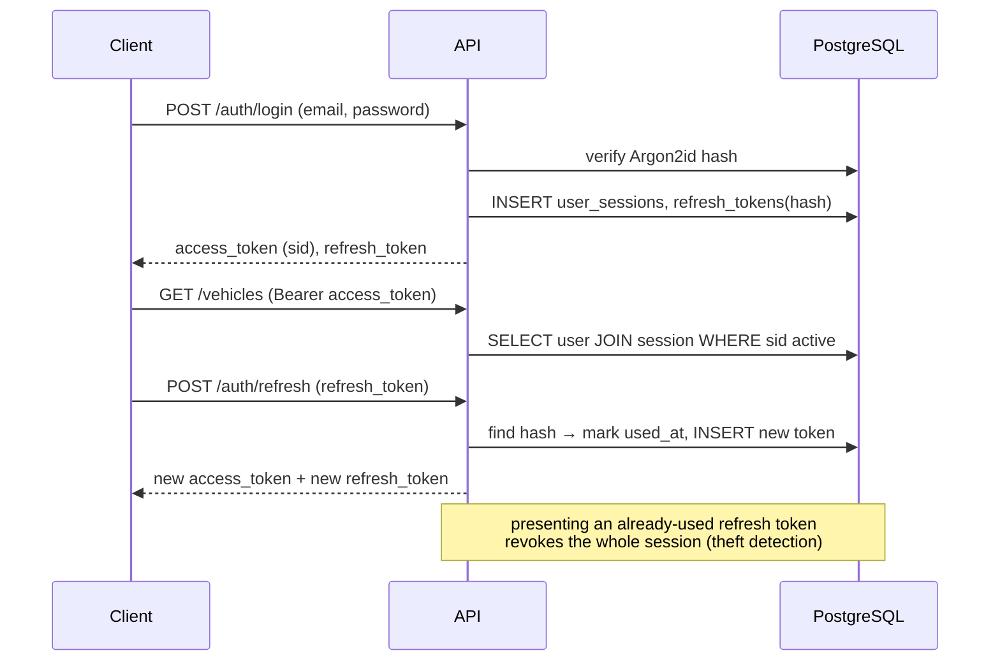

# 8–9, 26. Authentication, authorization and security

## 8. Authentication architecture

### Tokens

| Token          | Format                                   | Lifetime (default) | Stored server side                     |
|----------------|------------------------------------------|--------------------|----------------------------------------|
| Access token   | JWT HS256 signed with `JWT_SECRET`       | 15 minutes         | No (stateless), but carries `sid`      |
| Refresh token  | 256-bit random opaque string (URL-safe)  | 30 days            | HMAC-SHA256(`JWT_REFRESH_SECRET`, token) in `refresh_tokens` |
| Reset token    | 256-bit random opaque string             | 30 minutes         | HMAC-SHA256 hash in `password_reset_tokens` |

Access token claims: `sub` (user id), `sid` (session id), `type=access`, `iat`,
`exp`, `jti`, `iss`, `aud`. Decoding requires the expected algorithm, issuer,
audience and token type — `alg=none` and algorithm confusion are rejected.

Refresh and reset tokens are opaque on purpose: they are only ever compared to a
server-side hash, so they cannot be forged or decoded and a database leak does
not reveal usable tokens (HMAC with a server secret, not a plain hash).

### Sessions and rotation

* Each login creates a `user_sessions` row (device, IP, user agent).
* Every refresh **rotates** the refresh token: the old one is marked `used_at`.
  Re-use of a rotated token means it was stolen → the session is revoked.
* Access tokens carry `sid`; `get_current_user` loads the user and the session in
  one query, so logout and "revoke session" take effect immediately, not after the
  access token expires.
* Logout revokes the current session; "logout everywhere", password change,
  password reset and account deletion revoke all sessions.
* `GET /users/me/sessions` lists active sessions, `DELETE /users/me/sessions/{id}`
  revokes one.

### Passwords

* Argon2id via `argon2-cffi` with OWASP parameters (time cost 3, 64 MiB, parallelism 4).
  Hashes are re-computed on login when the parameters change (`check_needs_rehash`).
* Policy: 8–128 characters, at least one letter and one digit, must not contain
  the email local part. Passwords are never logged or returned.
* Login failures return the same `INVALID_CREDENTIALS` error for unknown email and
  wrong password, and a dummy hash is verified for unknown emails to keep timing
  constant (no user enumeration).
* `POST /auth/password/forgot` always answers `202 Accepted`.

### OAuth readiness

Authentication lives in `modules/auth`. Adding Google/Apple sign-in requires a
`user_identities(provider, subject, user_id)` table and a callback endpoint that
issues the same session + token pair; the rest of the system only depends on
`get_current_user`.

## 9. Authorization architecture

Two independent layers:

### Global roles (`users.role`)

| Role    | Purpose                                                |
|---------|--------------------------------------------------------|
| `user`  | Default. Access to own data and shared vehicles.       |
| `admin` | Reserved for operational endpoints (none exposed yet). |

### Vehicle roles

| Role     | Source                     | Read | Create/update/delete records | Update vehicle | Delete vehicle, manage sharing |
|----------|----------------------------|:----:|:----------------------------:|:--------------:|:------------------------------:|
| `owner`  | `vehicles.owner_id`        | ✔    | ✔                            | ✔              | ✔                              |
| `editor` | `vehicle_access.role`      | ✔    | ✔                            | ✔              | ✘                              |
| `viewer` | `vehicle_access.role`      | ✔    | ✘                            | ✘              | ✘                              |

Implementation:

* `VehicleRole` is an ordered enum (`viewer < editor < owner`).
* The dependency `require_vehicle_access(min_role)` resolves the caller's role on
  `{vehicle_id}` in **one query**
  (`vehicles LEFT JOIN vehicle_access ON user_id = :me`).
  * vehicle missing **or** no access → `404 NOT_FOUND` (no ID probing).
  * access but insufficient role → `403 FORBIDDEN`.
* Child resources are always loaded with **both** their id and the vehicle id
  (`WHERE id = :id AND vehicle_id = :vehicle_id`), so a record of vehicle A can
  never be read through the URL of vehicle B.
* User-owned resources (garages, custom maintenance/part types, alerts,
  notification preferences) are filtered by `user_id = current_user.id`.
* References inside request bodies (garage_id, maintenance_type_id,
  part_type_id, maintenance_record_id, entity ids for attachments and notes) are
  validated for visibility by the service before being stored. IDs coming from the
  client are never trusted.

## 26. Security recommendations (implemented unless stated otherwise)

| Area                  | Measure                                                                                 |
|-----------------------|-----------------------------------------------------------------------------------------|
| Password storage      | Argon2id, re-hash on parameter change                                                   |
| JWT                   | Short-lived, strict algorithm/issuer/audience/type checks, secrets ≥ 32 chars enforced at startup in production |
| Refresh tokens        | Opaque, HMAC-hashed at rest, rotated, re-use detection                                  |
| Authorization         | Per-vehicle role checks, 404 for foreign resources, ownership validation of every referenced id |
| Input validation      | Pydantic strict schemas, `extra="forbid"` on request bodies, bounded string lengths and numeric ranges |
| SQL injection         | SQLAlchemy bound parameters everywhere; `LIKE` patterns escaped; sort fields whitelisted |
| Rate limiting         | Global per-IP limit + strict limits on login, register, refresh, password reset, uploads |
| CORS                  | Explicit origin list from `CORS_ORIGINS`; no wildcard with credentials                  |
| HTTP headers          | `X-Content-Type-Options`, `X-Frame-Options: DENY`, `Referrer-Policy`, `Permissions-Policy`, CSP `default-src 'none'` for API responses, HSTS in production |
| File uploads          | Size limit (streamed), MIME detection from magic bytes, extension allow-list, sanitized names, random storage keys outside the web root, `Content-Disposition: attachment` and `nosniff` on download |
| Secrets               | Only from environment variables; `.env` git-ignored; startup refuses default secrets in production |
| Logging               | Structured logs with a redaction processor for passwords, tokens, secrets and authorization headers |
| Audit                 | `audit_logs` for login success/failure, logout, password change/reset, account deletion, sharing changes, vehicle deletion |
| Errors                | No stack traces or SQL in responses; 500 returns a generic message + request id         |
| Docs exposure         | Swagger UI / OpenAPI only when `ENABLE_DOCS=true` (default in development only)         |
| Health endpoints      | Report status only, no versions, hostnames or connection strings                         |
| Containers            | Non-root user, read-only application code, slim base image                              |
| Transport             | TLS terminated at the reverse proxy (Caddy/Nginx/Traefik); uvicorn `--proxy-headers` with explicit trusted proxy IPs |
| Dependencies          | Pinned lower bounds; run `pip-audit` in CI (recommended)                                |
| Future                | Email verification flow, 2FA (TOTP), account lockout notifications, CAPTCHA on registration if abused |
